# Order Shop

## Overview

Order Shop is a fully functional e-commerce application with two user roles: customers, who can browse and purchase products, and admins, who can manage orders and inventory. It's built using Next.js for the client-side and Express.js for the server-side. The application integrates with Google Drive for image storage and uses MongoDB for data persistence.

## Features

- **Admin Dashboard**: Monitor and manage incoming orders in a clean, organized interface.
- **Product & Category Management**: Add, update, and delete products and categories — complete with image support via Google Drive.
- **Google Drive Integration**: Securely upload and manage images through the Google Drive API using OAuth2.
- **Responsive UI**: Optimized design for desktop and mobile access using Tailwind CSS.

## Tech Stack

- **Frontend**: Next.js, React, Tailwind CSS
- **Backend**: Express.js, MongoDB
- **Image Storage**: Google Drive API with OAuth2

## Getting Started

### Prerequisites

- Node.js
- npm or yarn
- MongoDB
- Google Cloud account for Drive API

### Installation

1. **Clone the repository**:
   ```bash
   git clone https://github.com/yourusername/order_shop.git
   cd order_shop
   ```

2. **Install dependencies**:
   ```bash
   # For client
   cd client
   npm install
   # or
   yarn install

   # For server
   cd ../server
   npm install
   # or
   yarn install
   ```

3. **Environment Variables**:
   - Create a `.env.local` file in both `client` and `server` directories.
   - Add your MongoDB URI, Google API credentials, and other necessary environment variables.

4. **Run the development server**:
   ```bash
   # For client
   cd client
   npm run dev
   # or
   yarn dev

   # For server
   cd ../server
   npm start
   ```

5. **Open your browser**:
   - Visit `http://localhost:3000` for the client-side application.
   - The server runs on `http://localhost:8080`.

## Project Structure

- **client**: Contains the Next.js application.
  - **components**: Reusable React components.
  - **pages**: Next.js pages.
  - **styles**: Global styles and Tailwind CSS configuration.

- **server**: Contains the Express.js application.
  - **lib**: Utility functions and database models.
  - **routes**: API endpoints.

## Screenshots & Usage Guide


### 🔹 View and Add Category
 Steps to view and add a category to the system.

<div align="center">
  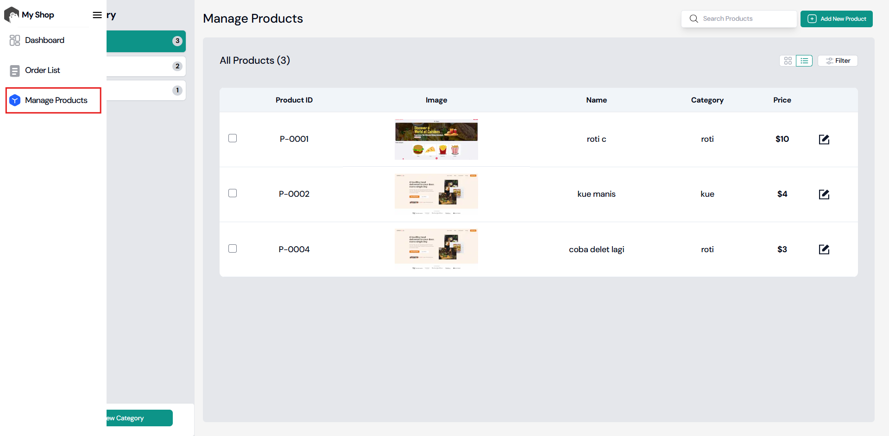
  <p><em>Step 1</em></p>
  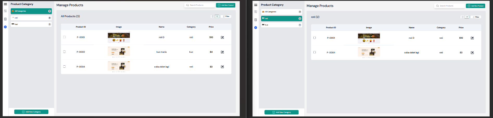
  <p><em>Step 2</em></p>
  
  <p><em>Step 3</em></p>
  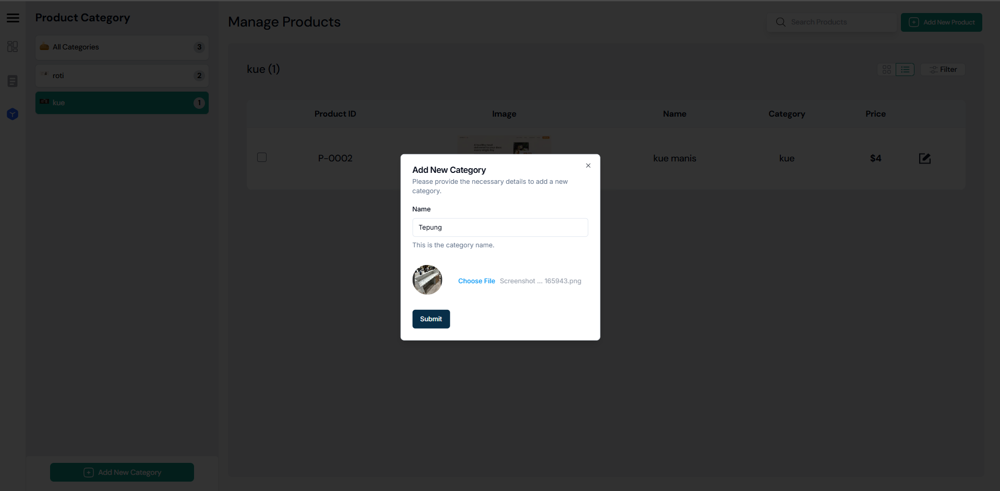
  <p><em>Step 4</em></p>
  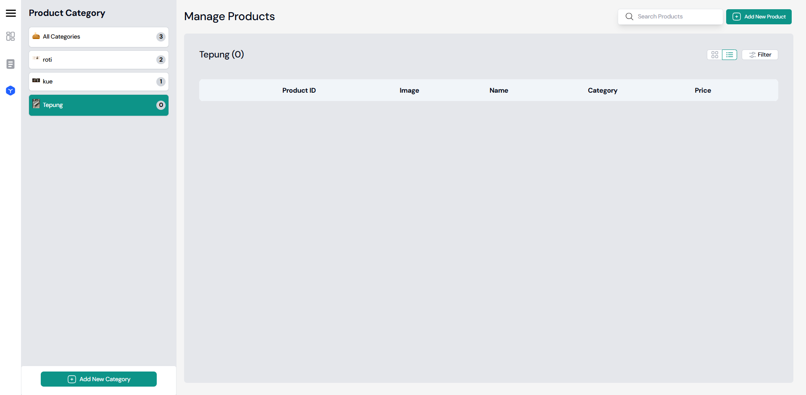
  <p><em>Step 5</em></p>
  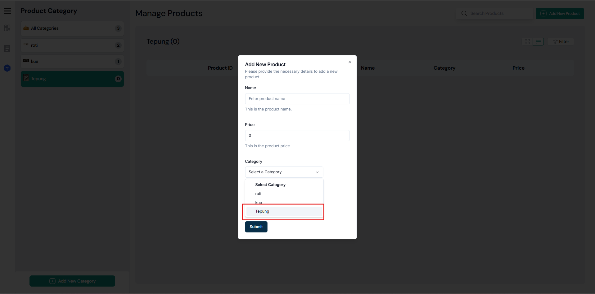
  <p><em>Step 6</em></p>
</div>

---

### 🔹 View Products
Display list of all products.

<div align="center">
  
  <p><em>Step 1</em></p>
  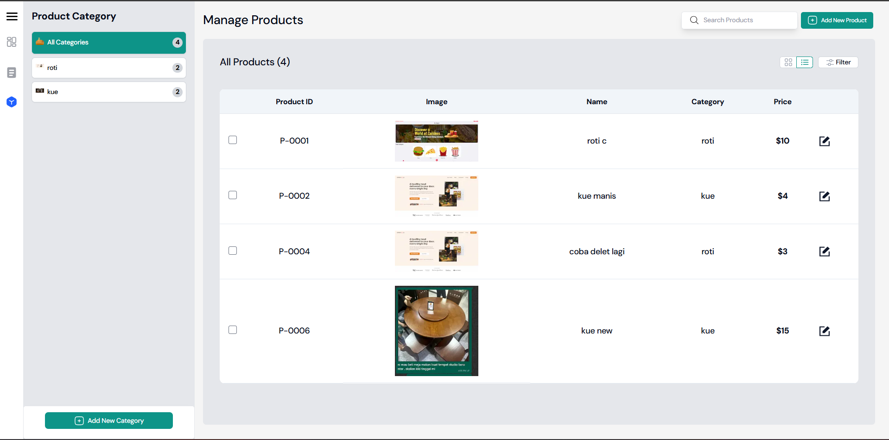
  <p><em>Step 2</em></p>
  
  <p><em>Step 3</em></p>
  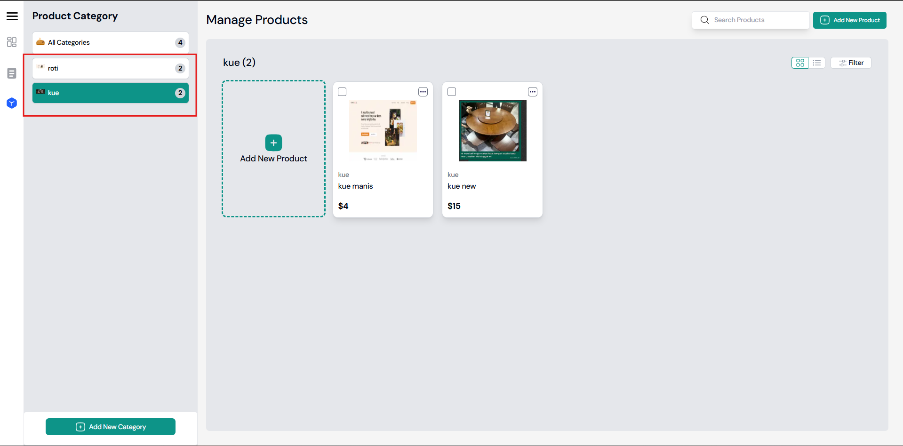
  <p><em>Step 4</em></p>
</div>

---

### 🔹 Add Product
Steps to add a product to the system.

<div align="center">
  
  <p><em>Step 1</em></p>
  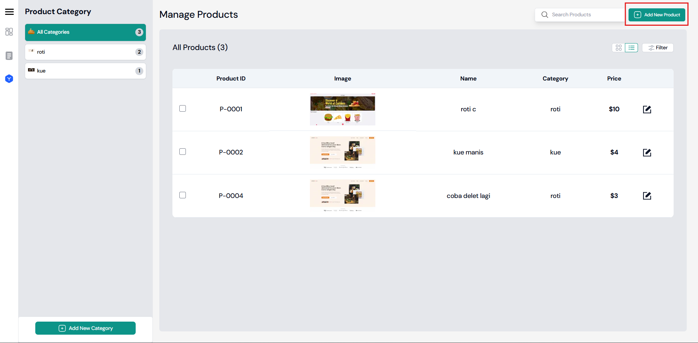
  <p><em>Step 2</em></p>
  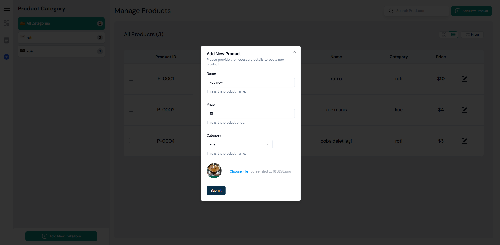
  <p><em>Step 3</em></p>
  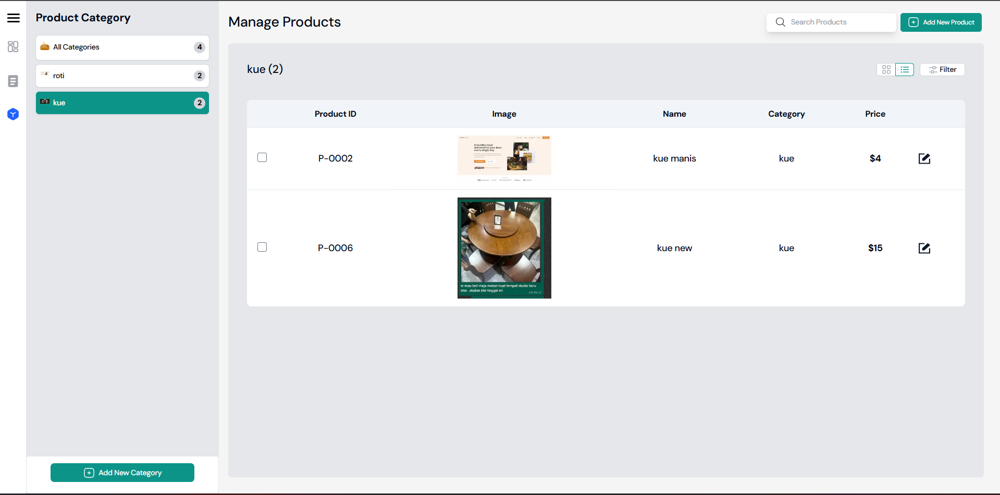
  <p><em>Step 4</em></p>
  
  <p><em>Step 5</em></p>
  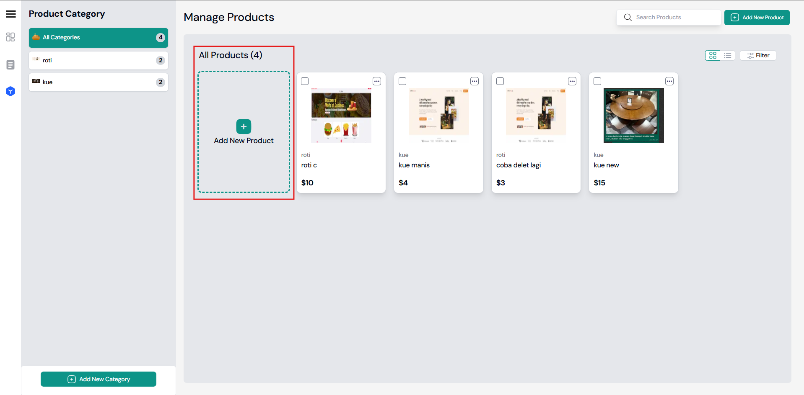
  <p><em>Step 6</em></p>
</div>

---

### 🔹 Delete Product
Delete multiple products at once.

<div align="center">
  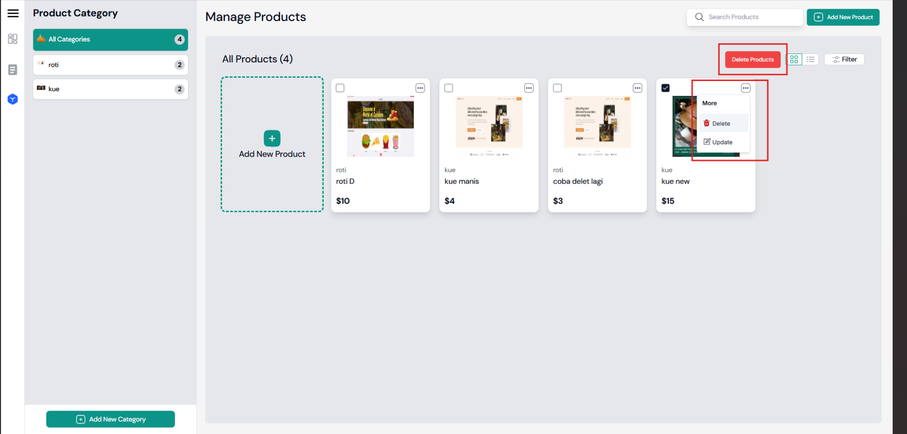
  <p><em>Step 1</em></p>
  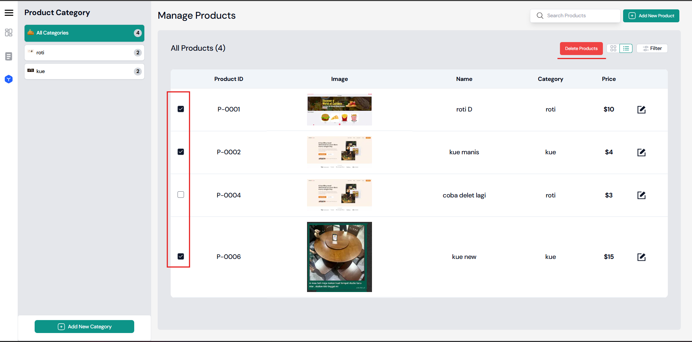
  <p><em>Step 2</em></p>
  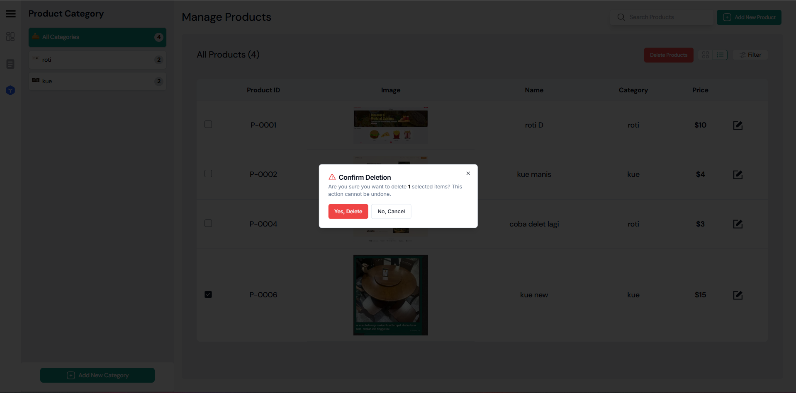
  <p><em>Step 3</em></p>
  
  <p><em>Step 4</em></p>
</div>

---

### 🔹 Filter Products
Filter products by price or category.

<div align="center">
  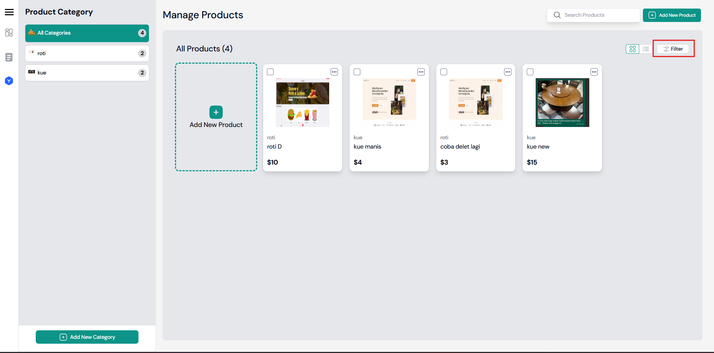
  <p><em>Step 1</em></p>
  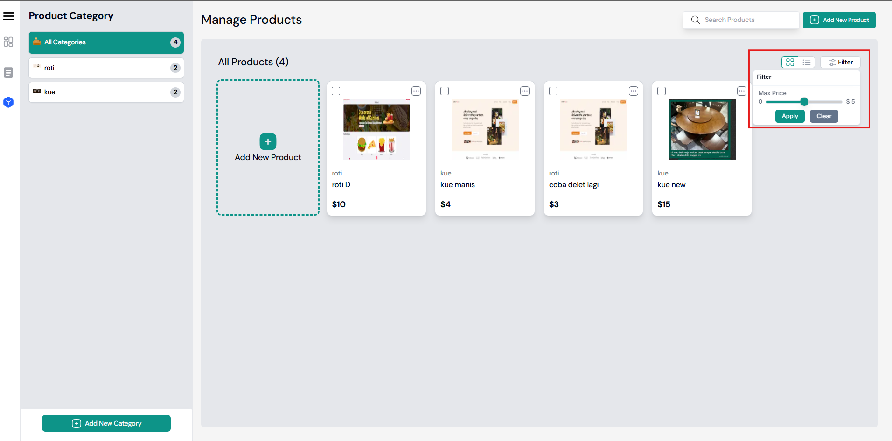
  <p><em>Step 2</em></p>
  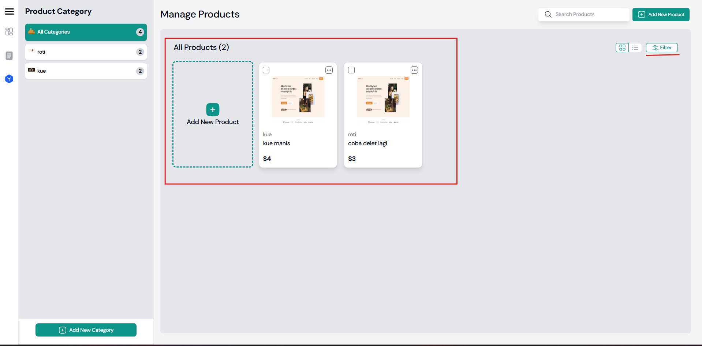
  <p><em>Step 3</em></p>
</div>

### 🔹 Update Product
Steps to edit an existing product.

<div align="center">
  
  <p><em>Step 1</em></p>
  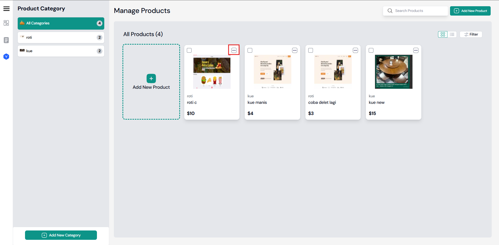
  <p><em>Step 2</em></p>
  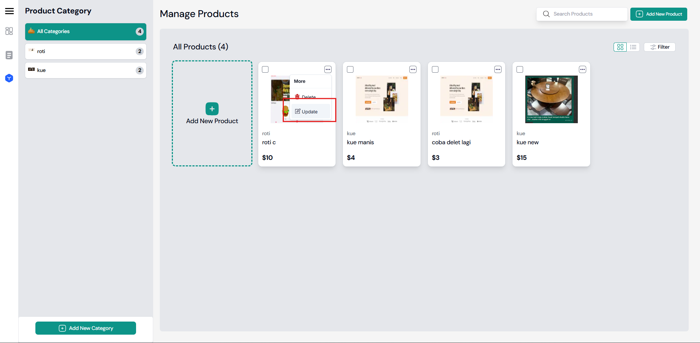
  <p><em>Step 3</em></p>
  
  <p><em>Step 4</em></p>
  
  <p><em>Step 5</em></p>
</div>

---

## Table of Contents
- [Add Product](#add-product)
- [View Products](#view-products)
- [Update Product](#update-product)
- [Delete Product](#delete-product)
- [Add Category](#add-category)
- [View Categories](#view-categories)


## Deployment

To deploy the application, you can run both the client and server on a Virtual Private Server (VPS). This setup allows you to manage and control the deployment environment directly on the VPS.

## Acknowledgments

- [Next.js Documentation](https://nextjs.org/docs)
- [Express.js Documentation](https://expressjs.com/)
- [Google Drive API](https://developers.google.com/drive)